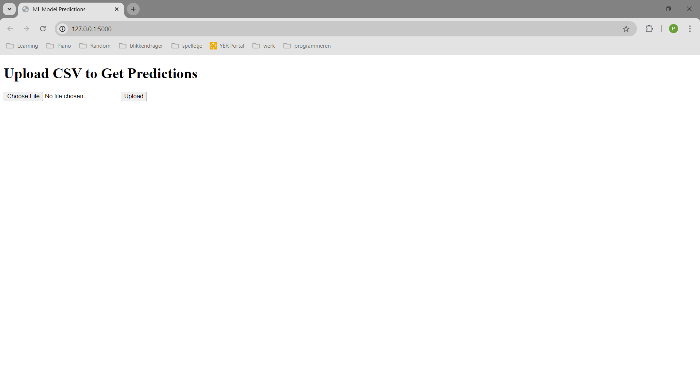
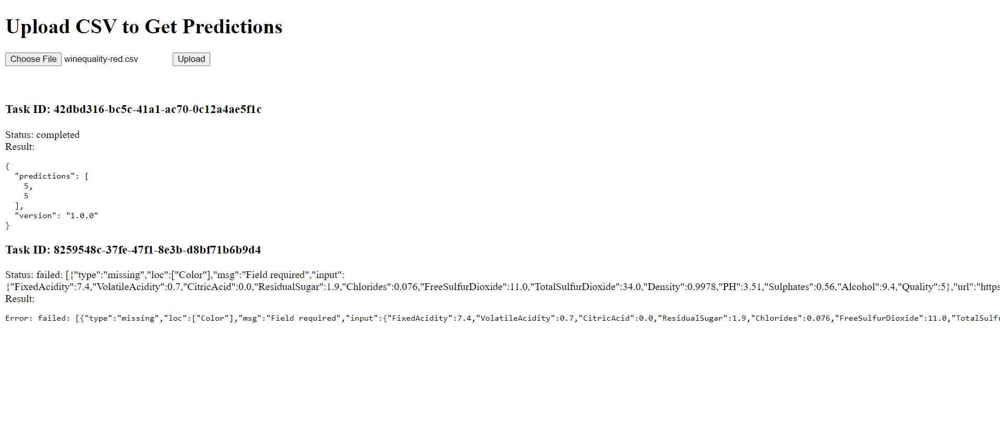

# Introduction 
This project focuses on the creation and deployment of a machine learning model that can predict the quality of a wine 
given a number of features.

# Getting Started
The code runs on an Azure WebApp, which uses a docker container. The WebApp is turned off because the project depends on
the free tier of Azure. This comes with limited resources. This section will therefore show the steps to run the api 
locally.
1. Navigate to a folder in which you want to clone the repo.
2. Clone the repo.
```
git clone https://pepijnclarijs@dev.azure.com/pepijnclarijs/ML-wine-quality/_git/ML-wine-quality
```
2.	Navigate to the ML-wine-quality folder.
```
cd ML-wine-quality
```
3.	Create virtual environment.\n

On Linux/MacOS:
```
python3 -m venv venv
```
On Windows:
```
python -m venv venv
```
4.	Activate the virtual environment.

On Linux/MacOS:
```
source venv/bin/activate
```
On Windows:
```
venv\Scripts\activate
```

5. Install requirements.
```
pip install -r requirements.txt
```

6. Run the api locally.
On Windows/Linux/MacOS:
```
python -m api.main --local
```

# Example API
When navigating to the local server: http://127.0.0.1:5000, you should see the frontend of the API as shown in the 
image. .
After uploading an example CSV (for example the csv from ML-wine-quality/ml_model/datasets/test_predictions.csv for 
happy flow and ML-wine-quality/ml_model/datasets/winequality-red.csv for unhappy flow) you should see messages like in
the image below. . It is possible to upload more than one csv file,
even when the first csv file is still being processed.

# CI/CD
A CI/CD pipeline is available for this project. It was configured to automatically run on changes to either the 
development or production branch. The pipeline would recreate the docker image and push it to a docker hub. Since 
Azure's free tier is quite limited in its resources, it was not possible to set up an agent to run this pipeline on. It
was, however, possible to set up my local machine as an agent. As I don't want my PC to continuously listen for jobs,
I have taken the agent offline. 

# Azure Web APP
In order to publish the API, an azure WebApp has been created and set up to use the container image: 
'pepijnclarijs/ml-wine-registry:latest' from my docker hub. Pushes to the code Repo on azure would update this image and
automatically update the published API. The WebApp is turned off, however, as the usage needs to be limited when using 
the free tier of Azure.
